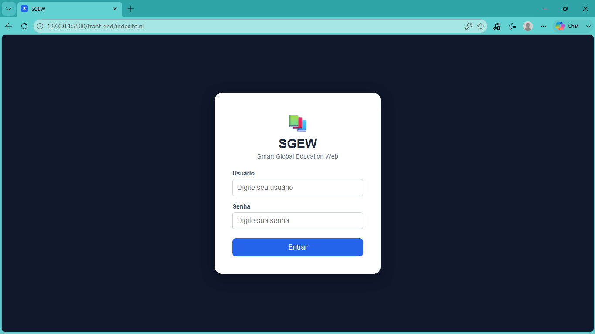
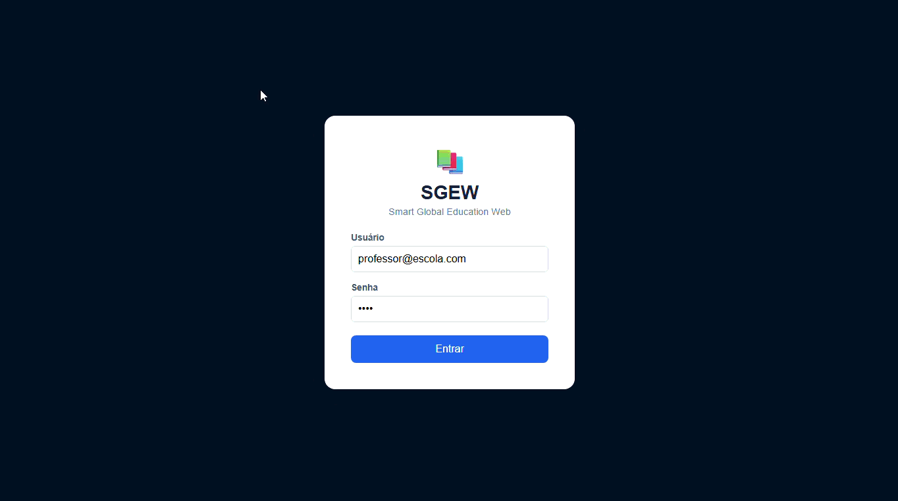
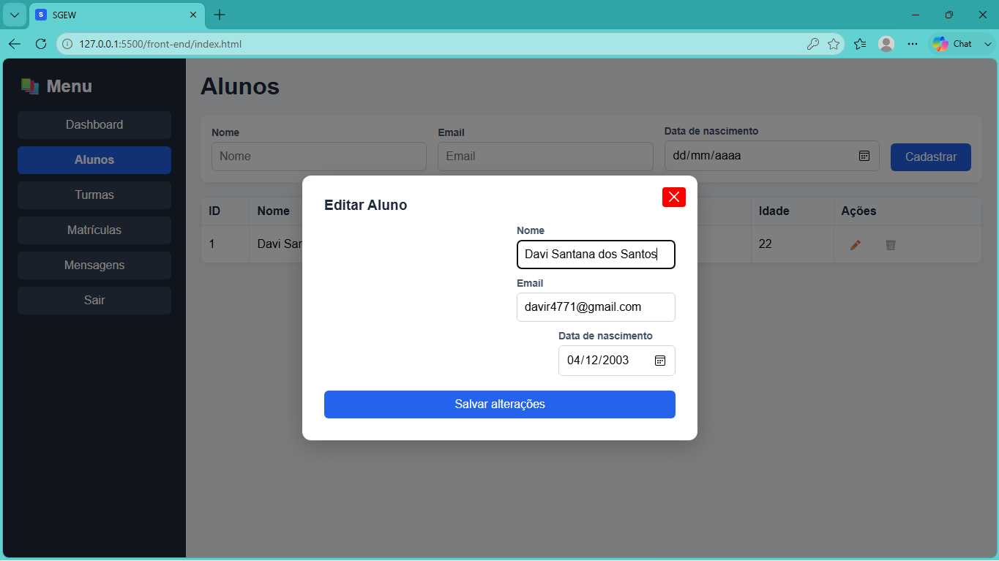
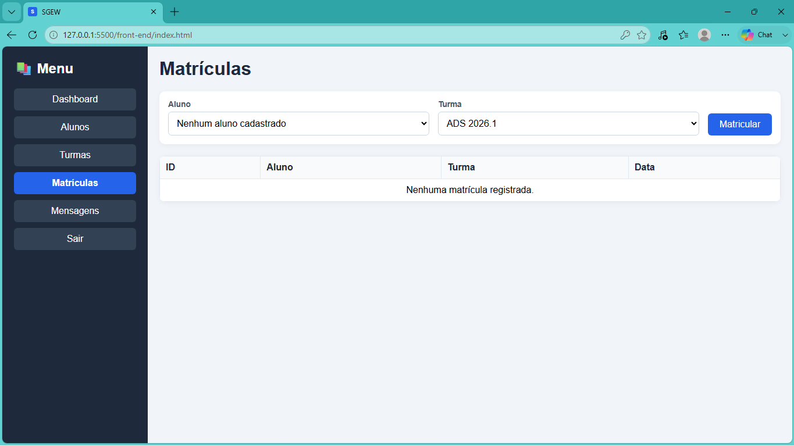
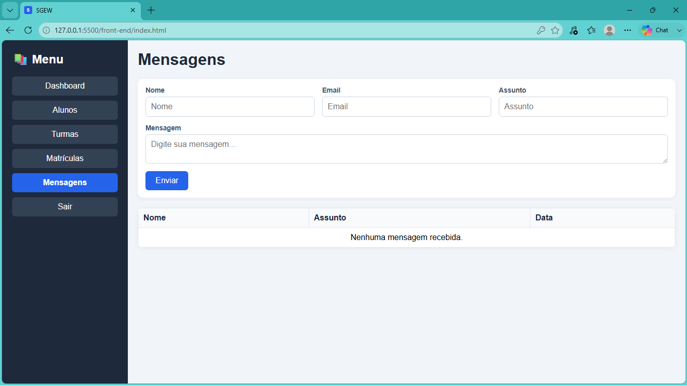
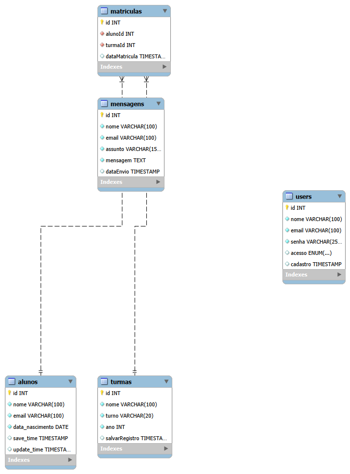

# Smart Global Education Web

Sistema web de gerenciamento escolar desenvolvido para cadastro de alunos, turmas e matrículas, utilizando arquitetura cliente-servidor com API REST. O projeto foi desenvolvido com Node.js, Express e MySQL no back-end, além de HTML, CSS e JavaScript no front-end.

## Funcionalidades

* Sistema de autenticação real no back-end
* Controle de permissões
* Cadastro de alunos, turmas e usuários
* Consulta de registros
* Atualização de dados
* Exclusão de registros
* Sistema de matrícula
* Integração entre Front-end e Back-end
* API REST

## Tecnologias Utilizadas

### Back-end

* 
* 
* 
* 

### Front-end

* HTML5
* CSS3
* JavaScript

### Ferramentas

* Git
* GitHub
* VS Code
* Postman

## Demonstração

### login

### Usuários

### Dashboard

### Gerenciamento de Alunos

### Turmas

### Matrículas

### Mensagens

## Como Executar

### 1. Clonar o repositório

git clone https://github.com/DaviSantos21/Smart-Global-Education-Web.git

### 2. Entrar na pasta

cd Smart-Global-Education-Web-master

### 3. Instalar dependências

npm install 

### 4. Configurar banco de dados

Crie o banco sistema_escolar e importe o arquivo localizado em database/sistema_escolar.sql

Diagrama do banco de dados

### 5. Iniciar servidor

npm run dev

Servidor disponível em:

http://localhost:3000

## Endpoints da API

### Login

POST /login

### Usuários

GET /users

POST /users

PUT /users

DELETE /users

### Alunos

GET /alunos

POST /alunos

PUT /alunos/:id

DELETE /alunos/:id

### Turmas

GET /turmas

POST /turmas

PUT /turmas/:id

DELETE /turmas/:id

### Matrículas

GET /matriculas

POST /matriculas

### Mensagens

GET /mensagens

POST /mensagens

## Melhorias Futuras
* Deploy do sistema em ambiente online
* HTTPS em produção
* Dashboard com gráficos e relatórios
* Melhorias de interface 
* Uso de APIs externas
* Chat online

## 👨‍💻 Autor

Davi Santana dos Santos

Estudante de Ciência da Computação (5º semestre)

GitHub:
https://github.com/DaviSantos21

LinkedIn:
https://www.linkedin.com/in/davi-santana-885850237/

## Aprendizados

Durante o desenvolvimento deste projeto foram aplicados conceitos de:

- Arquitetura MVC
- API REST
- CRUD completo
- Middleware para proteção de cada rota individualmente no back-end
- Integração Front-end e Back-end
- Criptografia de senhas com bcrypt
- Token JWT
- Modelagem de Banco de Dados
- Relacionamentos SQL
- Versionamento com Git e GitHub
- Manipulação de requisições HTTP
