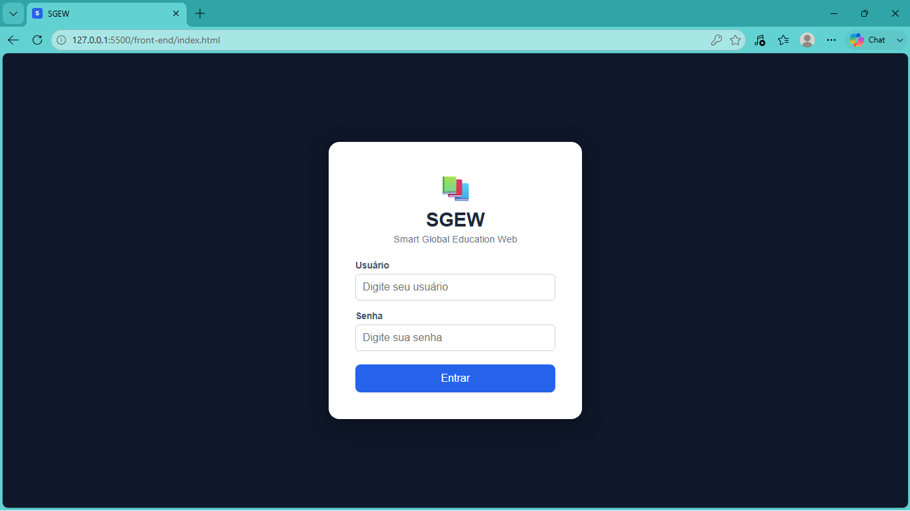
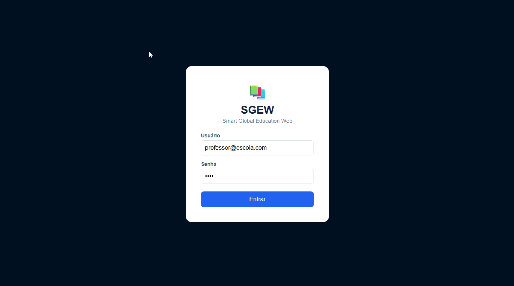
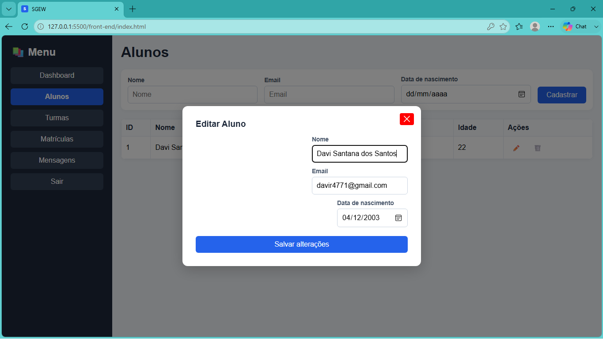
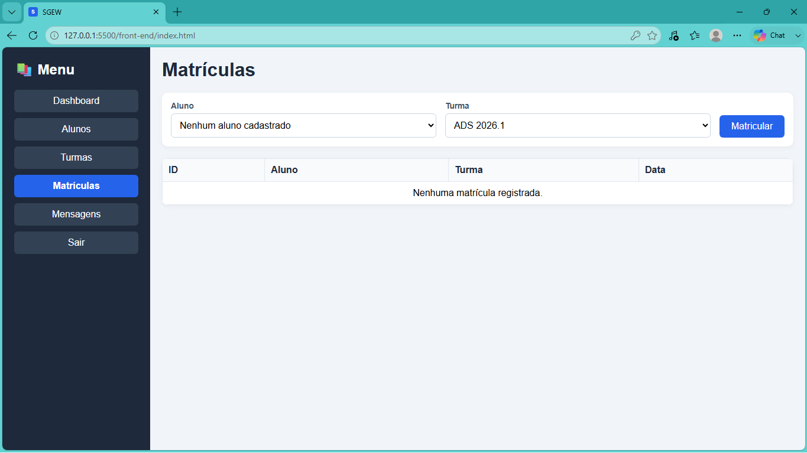
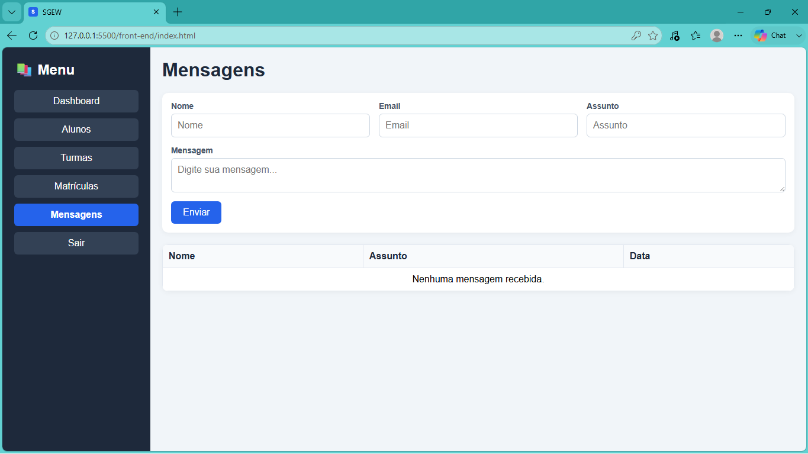
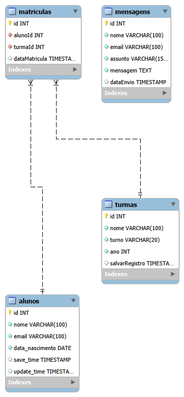

# Smart Global Education Web

* 
*  
* 
* 

Sistema web de gerenciamento escolar desenvolvido para cadastro de alunos, turmas e matrículas, utilizando arquitetura cliente-servidor com API REST. O projeto foi desenvolvido com Node.js, Express e MySQL no back-end, além de HTML, CSS e JavaScript no front-end.

🌐 Acesse o sistema 

https://smart-global-education-web.vercel.app

## 🔑 Credenciais de Demonstração

Para testar a aplicação, utilize as seguintes credenciais:

| Campo | Valor |
|-------|-------|
| **Usuário** | `visitante@sgew.com` |
| **Senha** | `sgew2025` |
| **Nível de acesso** | `Secretaria` |

> **Observação:** Essas credenciais são destinadas exclusivamente para fins de demonstração e avaliação da aplicação.

## Funcionalidades

* Sistema de autenticação real no back-end com JWT
* Controle de permissões
* Cadastro de alunos, turmas e usuários
* Consulta de registros
* Atualização de dados
* Exclusão de registros
* Sistema de matrícula
* Integração entre Front-end e Back-end
* API REST
* Deploy do sistema em ambiente online

## Tecnologias Utilizadas

### Back-end

* 
* 
* 
* 
*  

### Front-end

* HTML5
* CSS3
* JavaScript

### Hospedagem

* Railway (back-end + banco de dados)
* Vercel (front-end)

### Ferramentas

* Git
* GitHub
* VS Code
* Postman

## Demonstração

### login

### Usuários

### Dashboard

### Gerenciamento de Alunos

### Turmas

### Matrículas

### Mensagens

## Como Executar Localmente

### 1. Clonar o repositório

git clone https://github.com/DaviSantos21/Smart-Global-Education-Web.git

### 2. Entrar na pasta

cd Smart-Global-Education-Web-master

### 3. Instalar dependências

npm install 

### 4. Configurar banco de dados

Crie o banco sistema_escolar e importe o arquivo localizado em database/sistema_escolar.sql

Diagrama do banco de dados

### 5. Configurar variáveis de ambiente

Renomeie .env.example para .env e preencha com suas credencias:

DB_HOST=
DB_USER=
DB_PASSWORD=
DB_NAME=
DB_PORT=
JWT_SECRET=

### 6. Iniciar servidor

npm run dev

Servidor disponível em:

http://localhost:3000

## Endpoints da API

### Login

POST /login

### Usuários

GET /users

POST /users

PUT /users/:id

DELETE /users/:id

### Alunos

GET /alunos

POST /alunos

PUT /alunos/:id

DELETE /alunos/:id

### Turmas

GET /turmas

POST /turmas

PUT /turmas/:id

DELETE /turmas/:id

### Matrículas

GET /matriculas

POST /matriculas

### Mensagens

GET /mensagens

POST /mensagens

## Melhorias Futuras

* API de e-mail para envio de notificações
* Foto de perfil com Cloudinary
* Dashboard com gráficos (Chart.js)
* Configurações do sistema
* HTTPS em produção
* Melhorias de interface

## 👨‍💻 Autor

Davi Santana dos Santos

Estudante de Ciência da Computação (5º semestre)

GitHub:
https://github.com/DaviSantos21

LinkedIn:
https://www.linkedin.com/in/davi-santana-885850237/

## Aprendizados

Durante o desenvolvimento deste projeto foram aplicados conceitos de:

- Arquitetura MVC
- API REST
- CRUD completo
- Middleware para proteção de cada rota individualmente no back-end
- Níveis de acesso por perfil de usuário
- Integração Front-end e Back-end
- Criptografia de senhas com bcrypt
- Autenticação com token JWT
- Modelagem de Banco de Dados
- Relacionamentos SQL
- Versionamento com Git e GitHub
- Manipulação de requisições HTTP
- Deploy em ambiente de produção (Railway + Vercel)
- Configuração de CORS para múltiplos ambientes
- Detecção automática de ambiente (local vs produção)
